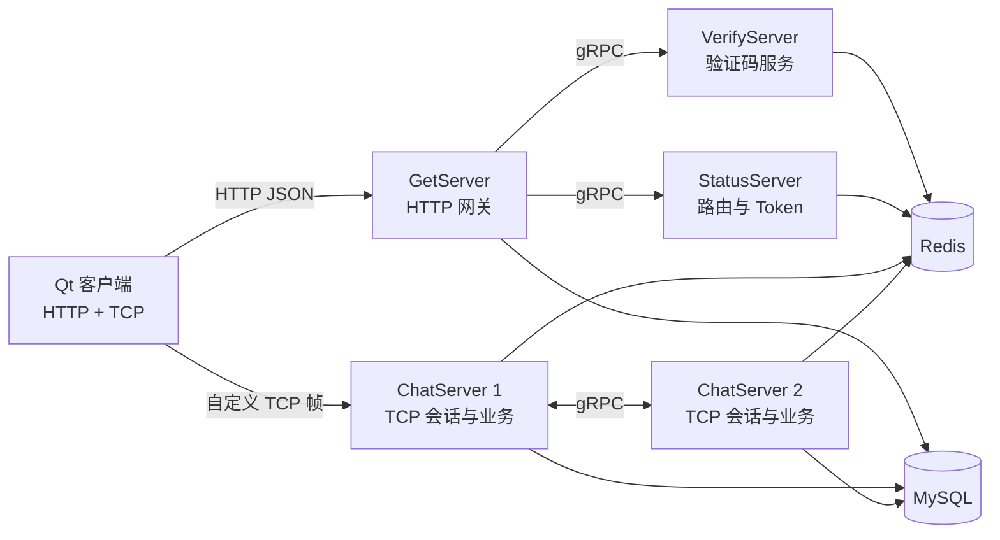

# DSchat

> 基于 Qt/C++ 的桌面端即时通讯学习项目，采用 HTTP、gRPC 与自定义 TCP 长连接组合，实现用户注册登录、好友关系和一对一实时消息的多节点路由。

## 项目简介

DSchat 将即时通讯链路拆为控制面和数据面。控制面处理验证码、注册、登录和聊天节点分配，使用 HTTP 与 gRPC；数据面在客户端与 ChatServer 之间建立自定义 TCP 长连接，承载登录、好友操作和一对一在线消息推送。

项目包含一个 Qt 6 桌面客户端、HTTP 网关、验证码服务、状态路由服务，以及两个同构的 ChatServer 实例。MySQL 用于保存用户与好友关系，Redis 用于验证码、Token、用户路由、缓存和节点在线计数。

## 功能范围

| 能力 | 当前实现 | 代码位置 |
|---|---|---|
| 邮箱验证码 | 网关经 gRPC 调用 Node.js 服务发送邮件，验证码写入 Redis 并设置过期时间 | `server/VerifyServer/server.js`、`server/GetServer/LogicSystem.cpp` |
| 注册、登录、重置密码 | GetServer 提供 HTTP POST 路由并访问 MySQL/Redis | `server/GetServer/LogicSystem.cpp` |
| 聊天节点分配 | StatusServer 轮询选择 ChatServer，生成 Token 并写入 Redis | `server/StatusServer/StatusServiceImpl.cpp` |
| TCP 登录 | 客户端携带 uid/Token 连接 ChatServer，服务端从 Redis 校验 | `client/DSchat/tcpmgr.cpp`、`server/ChatServer/LogicSystem.cpp` |
| 好友搜索、申请与认证 | 消息 ID 分发到对应业务 handler，MySQL 写入好友申请和关系 | `server/ChatServer/LogicSystem.cpp`、`MysqlDao.cpp` |
| 一对一在线文本消息 | 同节点直接推 Session，跨节点经 gRPC 通知 | `ChatServiceImpl.cpp`、`ChatGrpcClient.cpp` |
| 心跳与断线清理 | 定时扫描 Session，超时关闭连接并清理相关 Redis 状态 | `CServer.cpp`、`CSession.cpp` |
| 自定义消息气泡 | Qt 客户端提供文本与图片气泡界面组件 | `client/DSchat/textbubble.*`、`picturebubble.*` |

## 架构



### 登录与建连

1. 客户端通过 HTTP 向 GetServer 注册或登录。
2. GetServer 在登录成功后调用 StatusServer 的 `GetChatServer`。
3. StatusServer 选择一个 ChatServer，生成 Token，并将 Token 写入 Redis。
4. GetServer 向客户端返回 `host`、`port` 和 `token`。
5. 客户端使用 `QTcpSocket` 直连目标 ChatServer，并通过 TCP 登录帧提交 `uid` 与 `token`。
6. ChatServer 校验 Redis 中的 Token，绑定本机 Session，并记录用户所在节点。

### 在线消息路由

1. 客户端通过 TCP 发送文本消息帧。
2. ChatServer 从 Redis 查询目标用户的节点标识。
3. 目标在本节点时，从内存 `UserMgr` 获取 Session 并直接推送。
4. 目标在其他节点时，通过 gRPC `NotifyTextChatMsg` 调用目标 ChatServer。
5. 目标 ChatServer 将 gRPC 请求转换为本地 TCP 推送。

## TCP 协议

客户端与 ChatServer 使用固定头加 JSON body 的应用层帧协议。

| 字段 | 大小 | 说明 |
|---|---:|---|
| 消息 ID | 2 字节 | 决定登录、搜索、好友、文本聊天等处理器 |
| 消息长度 | 2 字节 | 消息体字节数，使用网络字节序 |
| 消息体 | 可变 | JSON 业务数据 |

服务端的 `CSession::AsyncReadHead`、`AsyncReadBody` 与 `asyncReadLen` 会累计读取直到完整帧，客户端的 `TcpMgr` 通过 `_buffer` 保存不完整数据，因此能处理 TCP 的粘包、半包与拆包。

## 目录结构

```text
DsChat/
├── client/
│   └── DSchat/                 # Qt 6 桌面客户端
├── server/
│   ├── GetServer/              # HTTP 注册、登录与密码重置网关
│   ├── VerifyServer/           # Node.js 邮箱验证码 gRPC 服务
│   ├── StatusServer/           # ChatServer 分配与 Token 状态服务
│   ├── ChatServer/             # 聊天节点实例 1
│   └── ChatServer2/            # 聊天节点实例 2
└── README.md                   # 项目说明文档
```

## 技术栈

| 层级 | 技术 | 用途 |
|---|---|---|
| 客户端 | Qt 6、C++、CMake | 桌面 UI、HTTP、TCP、资源与样式 |
| TCP 聊天服务 | C++、Boost.Asio | 异步 accept/read/write、Session 管理 |
| HTTP 网关 | Boost.Beast | HTTP 请求解析与响应 |
| 服务间通信 | gRPC、Protocol Buffers | 验证码、路由、跨节点通知 |
| 验证码服务 | Node.js、nodemailer、ioredis | 邮件发送与验证码缓存 |
| 持久化 | MySQL Connector/C++ | 用户、好友、申请关系 |
| 缓存与状态 | Redis、hiredis | Token、路由、缓存、在线状态 |
| JSON | JsonCpp、Qt JSON | TCP/HTTP 业务数据序列化 |

## 构建与运行

### 前置依赖

客户端需要 Qt 6.5+、CMake 和支持的 C++ 编译器。C++ 服务端项目当前提供 Visual Studio 工程与 `packages.config`，README 中列出的依赖包括 Boost 1.81+、MySQL Connector/C++、hiredis、gRPC、Protobuf 与 JsonCpp。验证码服务需要 Node.js 和 npm。运行时还需要可访问的 MySQL、Redis 与 SMTP 邮箱账号。

### 构建 Qt 客户端

```bash
cd client/DSchat
cmake -B build -DCMAKE_PREFIX_PATH=/path/to/Qt/6.x.x/gcc_64
cmake --build build
```

客户端启动时从可执行文件目录读取 `config.ini`，默认指向 `http://localhost:8080`。

### 构建 C++ 服务端

使用 Visual Studio 打开各服务目录中的 `.vcxproj` 或 `.sln`，恢复 `packages.config` 中的 NuGet 依赖后构建。现有项目目录包含 GetServer、StatusServer、ChatServer 和 ChatServer2 的工程文件。

### 启动验证码服务

```bash
cd server/VerifyServer
npm install
npm run server
```

### 推荐启动顺序

1. 启动 MySQL 与 Redis。
2. 配置并启动 VerifyServer。
3. 启动 StatusServer。
4. 启动 ChatServer 与 ChatServer2。
5. 启动 GetServer。
6. 启动 Qt 客户端。

当前仓库没有 Docker Compose、数据库初始化脚本或一键启动脚本。首次部署前需要自行准备与代码访问一致的 MySQL schema、SMTP 配置和 Redis 实例。

## 配置说明

| 配置文件 | 主要内容 |
|---|---|
| `client/DSchat/config.ini` | GetServer 地址 |
| `server/GetServer/config.ini` | VerifyServer、StatusServer、MySQL、Redis 地址 |
| `server/StatusServer/config.ini` | ChatServer 节点列表、MySQL、Redis 地址 |
| `server/ChatServer/config.ini` | 本节点 TCP/RPC 端口、对端节点、MySQL、Redis 地址 |
| `server/ChatServer2/config.ini` | 第二节点 TCP/RPC 端口与依赖地址 |
| `server/VerifyServer/config.json` | 邮箱与 Redis 配置 |

## 开发状态

项目当前更适合作为 C++ 网络编程、Qt 客户端、Boost.Asio 异步模型、Redis 路由和 gRPC 服务协作的学习工程。它尚未具备生产 IM 所需的可靠投递、安全治理、动态服务发现、自动化测试和完整部署体系。

## 致谢

本项目代码基于 B 站 UP 主 [恋恋风辰 zack](https://space.bilibili.com/271469206) 的 C++ 聊天服务器系列教程。
